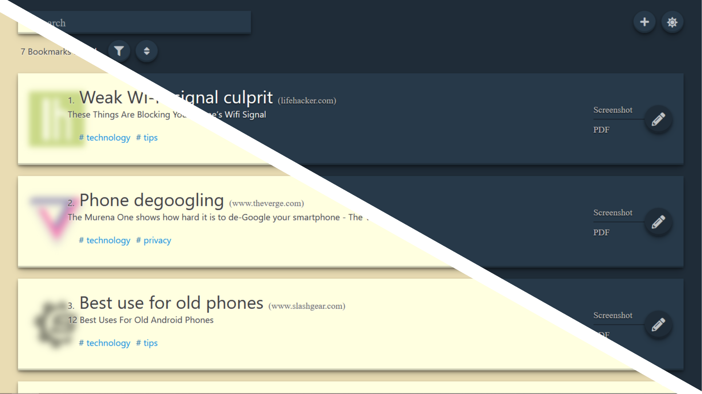

<h1>
LinkWarden

A place for your useful links.

     

</h1>

[Demo](https://linkwarden.netlify.app/) | [Intro & Motivation](https://github.com/Daniel31x13/link-warden#intro--motivation) | [Features](https://github.com/Daniel31x13/link-warden#features) | [Roadmap](https://github.com/Daniel31x13/link-warden/wiki#project-roadmap) | [Setup](https://github.com/Daniel31x13/link-warden#setup) | [Development](https://github.com/Daniel31x13/link-warden#linkwarden-development)

## Intro & Motivation

**LinkWarden is a self-hosted, open-source bookmark + archive manager to collect, and save websites for offline use.**

The objective is to have a self-hosted place to keep useful links in one place, and since useful links can go away (see the inevitability of [Link Rot](https://www.howtogeek.com/786227/what-is-link-rot-and-how-does-it-threaten-the-web/)), LinkWarden also saves a copy of the link as screenshot and PDF.

## Features

* 🔥 Sleek, minimalist design.

* 📦 Auto-capture a screenshot and PDF from each website.

* 🌤 Dark/Light mode support.

* ↔️ Responsive design.

* 🔎 Search, filter and sorting functionality.

* 💨 Lazy loading support (for better performance).

* 🏷 Set multiple tags to each link.

* 🗂 Assign each link to a collection where we can further group links.

**Also take a look at our planned features in the [project roadmap section](https://github.com/Daniel31x13/link-warden/wiki#project-roadmap).**

## Installation

### Using Docker Compose (Recommended)

1. Make sure Docker docker is installed.

2. Clone this repository.

4. [Optional] If you want to use this app across the network change `REACT_APP_API_HOST` in docker-compose.yml with the computer IP and API port.

3. head to the main folder and run `docker compose up -d`.

### Manual Setup

1. Make sure your MongoDB database and collection is up and running.

2. Edit [URI, Database name and Collection name](api/config.js) accordingly.

3. [Optional] If you want to use this app across the network change [`API_HOST`](src/config.js) address with the computer IP and API port.

4. Head to the main folder using terminal and run: `(cd api && npm install) && npm install --legacy-peer-deps` for the dependencies.

5. Run `npm start` to start the application.

## LinkWarden Development

All contributions are welcomed! But first please take a look at [how to contribute](.github/CONTRIBUTING.md).

> **For questions/help, feature requests and bug reports please create an [issue](https://github.com/Daniel31x13/link-warden/issues) (please use the right lable).**
