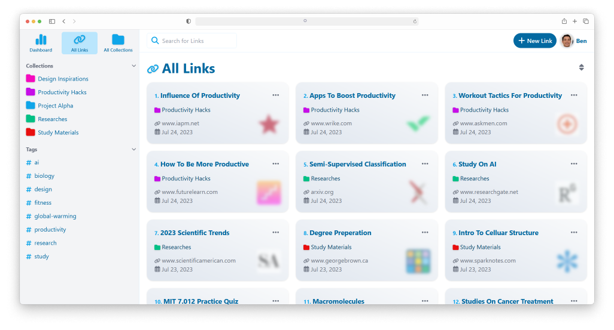
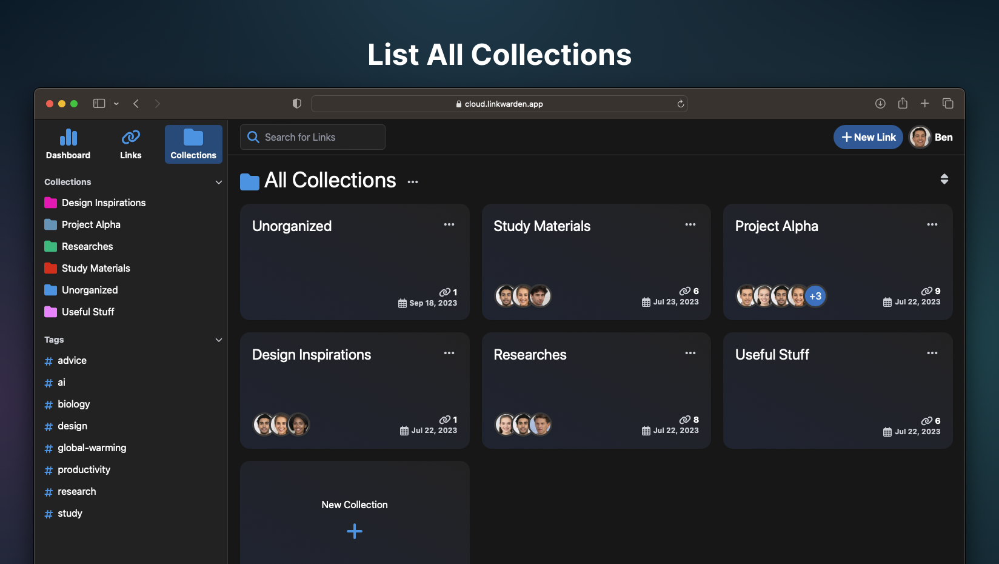
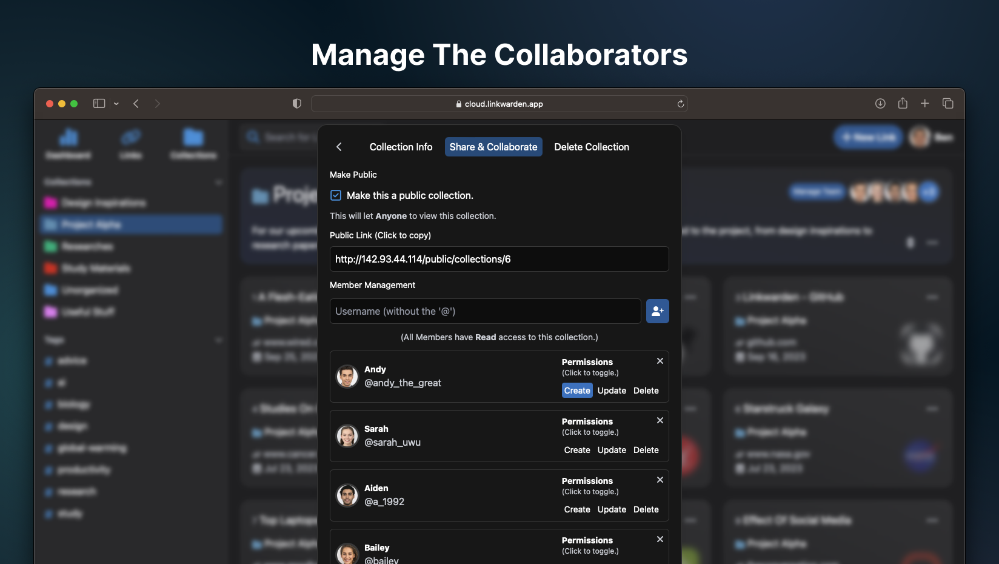
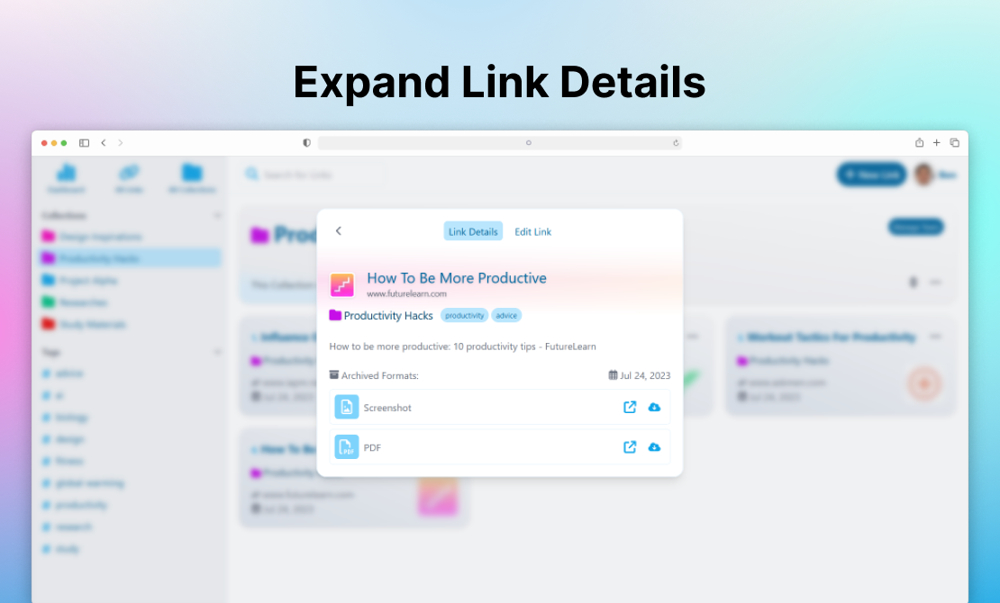

  
  <h1>Linkwarden</h1>

[Website](https://linkwarden.app) | [Getting Started](https://docs.linkwarden.app/getting-started) | [Features](https://github.com/linkwarden/linkwarden#features) | [Roadmap](https://github.com/orgs/linkwarden/projects/1) | [Screenshots](https://github.com/linkwarden/linkwarden#screenshots) | [Support ❤](https://github.com/linkwarden/linkwarden#support-)

## Intro & motivation

**Linkwarden is a self-hosted, open-source collaborative bookmark manager to collect, organize and archive webpages.** The objective is to organize useful webpages and articles you find across the web in one place, and since useful webpages can go away (see the inevitability of [Link Rot](https://www.howtogeek.com/786227/what-is-link-rot-and-how-does-it-threaten-the-web/)), Linkwarden also saves a copy of each webpage as a Screenshot and PDF, ensuring accessibility even if the original content is no longer available.

Additionally, Linkwarden is designed with collaboration in mind, sharing links with the public and/or allowing multiple users to work together seamlessly.

<b>A bit of a "history"</b>

Linkwarden has been completely rebuilt and redesigned from ground up, so pretty much the only thing it has in common with its predecessor is the idea behind it - bookmark management.

**What happened to the old version?**
We highly recommend you **not** to use the old version as it is no longer maintained and has much less features. But anyway if you really wanna check it out, here it is in [this repo](https://github.com/linkwarden/linkwarden-old).

## Main Tech Stack

- NextJS
- TypeScript
- Tailwind
- Prisma
- Zustand

## Features

- ✅ Auto capture a screenshot and a PDF of each link.
- ✅ Organize links by collection, name, description and multiple tags.
- ✅ Collaborate on gathering links in a collection.
- ✅ Customize the permissions of each member.
- ✅ Share your collected links with the world.
- ✅ Search, filter and sort by link details.
- ✅ Responsive design and supports most browsers.

## Roadmap

Make sure to check out our [public roadmap](https://github.com/orgs/linkwarden/projects/1).

## Docs

For information on how to get started or to set up your own instance, please visit the [documentation](https://docs.linkwarden.app).

## Development

If you want to contribute, Thanks! Start by checking our [public roadmap](https://github.com/orgs/linkwarden/projects/1), there you'll see a [readme item for contributers](https://github.com/orgs/linkwarden/projects/1?pane=issue&itemId=34708277) for the rest of the info on how to contribute to this repo.

## Security

If you found a security vulnerability, please do **not** create a public issue, instead send an email to [security@linkwarden.app](mailto:security@linkwarden.app) stating the vulnerability. Thanks!

## Screenshots

## Support ❤

Any [donations](https://opencollective.com/linkwarden) are highly appreciated. <3

Here are the other ways to support/cheer this project:

- Starring this repo.
- Joining us on [Discord](https://discord.com/invite/CtuYV47nuJ).
- Following @daniel31x13 on [Mastodon](https://mastodon.social/@daniel31x13), [Twitter](https://twitter.com/daniel31x13) and [GitHub](https://github.com/daniel31x13).
- Referring Linkwarden to a friend.

If you did any of the above, Thanksss! Otherwise thanks.
