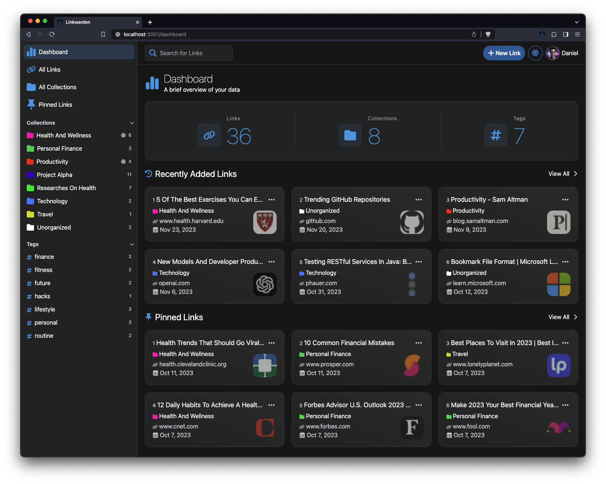
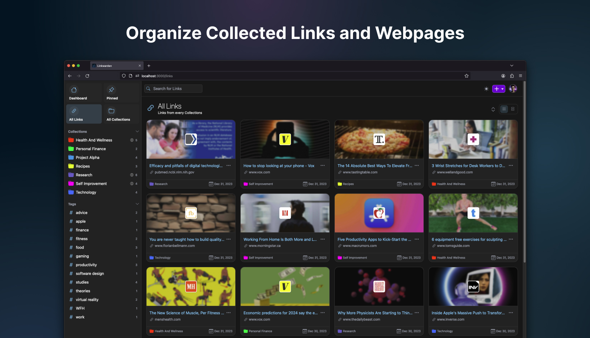
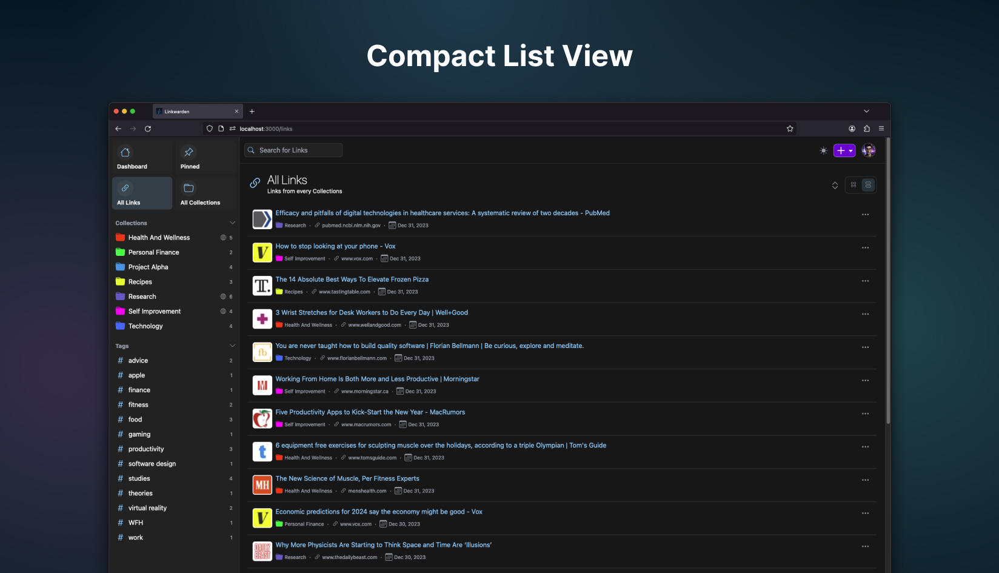
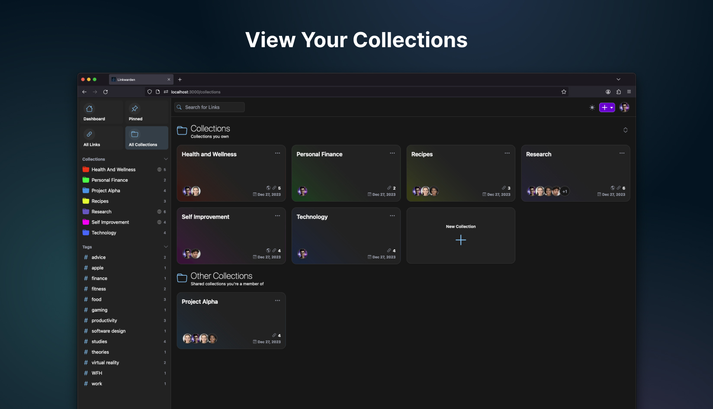
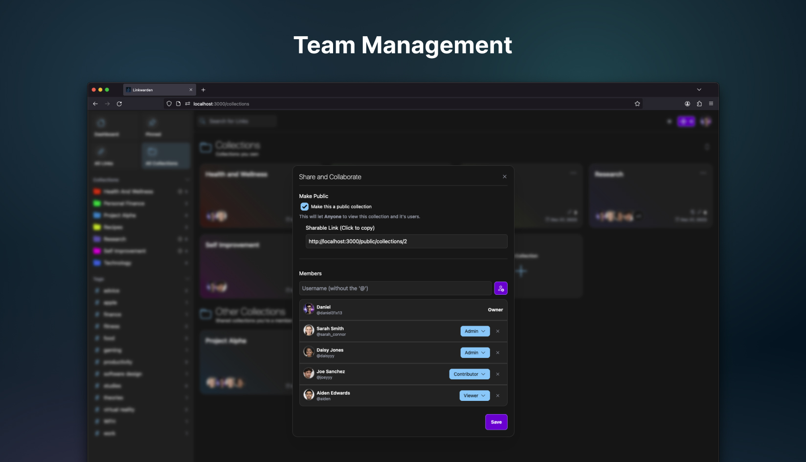
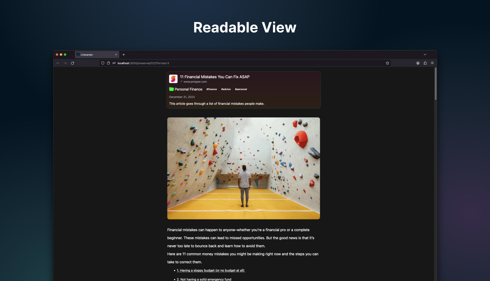
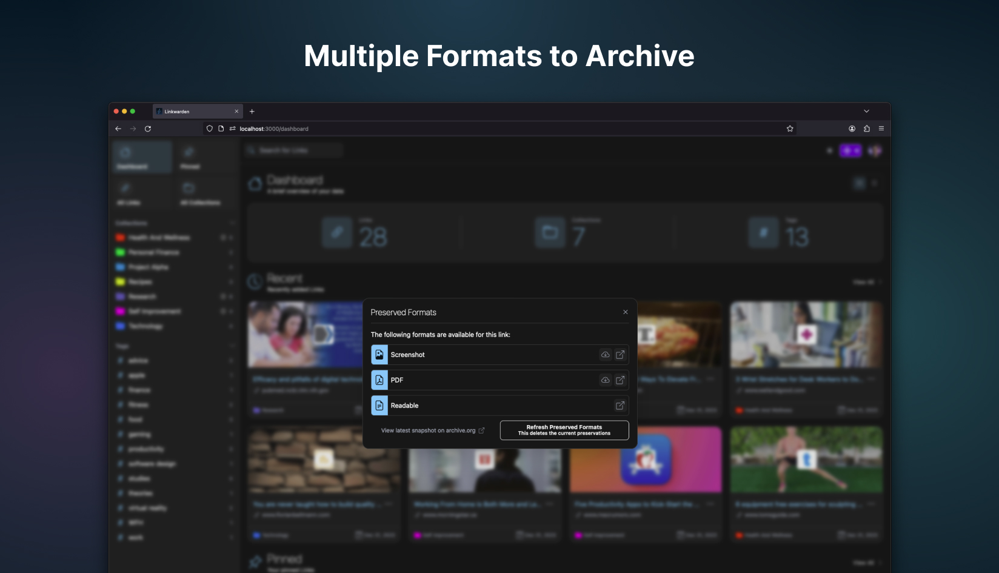
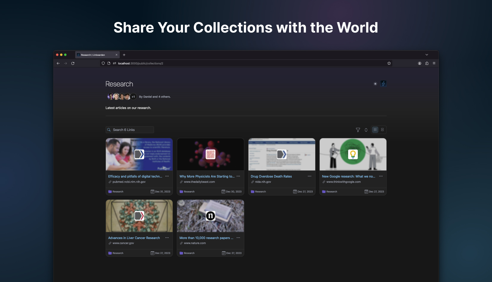
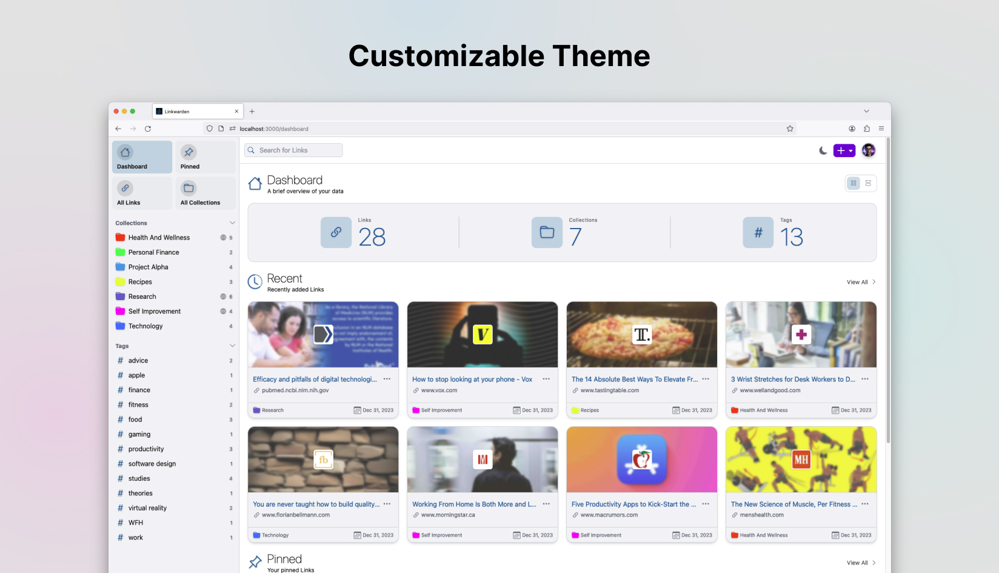

  
  <h1>Linkwarden</h1>
  <h3>Bookmark Preservation for Individuals and Teams</h3>

 <a href="https://news.ycombinator.com/item?id=36942308"></img></a>

[« LAUNCH DEMO »](https://demo.linkwarden.app)

[Cloud](https://cloud.linkwarden.app) · [Website](https://linkwarden.app) · [Features](https://github.com/linkwarden/linkwarden#features) · [Docs](https://docs.linkwarden.app)

## Intro & motivation

**Linkwarden is a self-hosted, open-source collaborative bookmark manager to collect, organize and archive webpages.**

The objective is to organize useful webpages and articles you find across the web in one place, and since useful webpages can go away (see the inevitability of [Link Rot](https://www.howtogeek.com/786227/what-is-link-rot-and-how-does-it-threaten-the-web/)), Linkwarden also saves a copy of each webpage as a Screenshot and PDF, ensuring accessibility even if the original content is no longer available.

Additionally, Linkwarden is designed with collaboration in mind, sharing links with the public and/or allowing multiple users to work together seamlessly.

> [!TIP]  
> Our official [Cloud](https://linkwarden.app/#pricing) offering provides the simplest way to begin using Linkwarden and it's the preferred choice for many due to its time-saving benefits.   Your subscription supports our hosting infrastructure and ongoing development.   Alternatively, if you prefer self-hosting Linkwarden, you can do so by following our [Installation documentation](https://docs.linkwarden.app/self-hosting/installation).

## Features

- 📸 Auto capture a screenshot, PDF, single html file, and readable view of each webpage.
- 🏛️ Send your webpage to Wayback Machine ([archive.org](https://archive.org)) for a snapshot. (Optional)
- ✨ Local AI Tagging to automatically tag your links based on their content (Optional).
- 📂 Organize links by collection, sub-collection, name, description and multiple tags.
- 👥 Collaborate on gathering links in a collection.
- 🎛️ Customize the permissions of each member.
- 🌐 Share your collected links and preserved formats with the world.
- 📌 Pin your favorite links to dashboard.
- 🔍 Full text search, filter and sort for easy retrieval.
- 📱 Responsive design and supports most modern browsers.
- 🌓 Dark/Light mode support.
- 🧩 Browser extension. [Star it here!](https://github.com/linkwarden/browser-extension)
- 🔄 Browser Synchronization (using [Floccus](https://floccus.org)!)
- ⬇️ Import and export your bookmarks.
- 🔐 SSO integration. (Enterprise and Self-hosted users only)
- 📦 Installable Progressive Web App (PWA).
- 🍎 iOS Shortcut to save Links to Linkwarden.
- 🔑 API keys.
- ✅ Bulk actions.
- 👥 User administration.
- 🌐 Support for Other Languages (i18n).
- 📁 Image and PDF Uploads.
- 🎨 Custom Icons for Links and Collections.
- 🔔 RSS Feed Subscription.
- ✨ And many more features. (Literally!)

## Like what we're doing? Give us a Star ⭐

## We're building our Community 🌐

Join and follow us in the following platforms to stay up to date about the most recent features and for support:

## Suggestions

We _usually_ go after the [popular suggestions](https://github.com/linkwarden/linkwarden/issues?q=is%3Aissue+is%3Aopen+sort%3Areactions-%2B1-desc). Feel free to open a [new issue](https://github.com/linkwarden/linkwarden/issues/new?assignees=&labels=enhancement&projects=&template=feature_request.md&title=) to suggest one - others might be interested too! :)

## Roadmap

Make sure to check out our [public roadmap](https://github.com/orgs/linkwarden/projects/1).

## Community Projects

Here are some community-maintained projects that are built around Linkwarden:

- [My Links](https://apps.apple.com/ca/app/my-links-for-linkwarden/id6504573402) - iOS and MacOS Apps, maintained by [JGeek00](https://github.com/JGeek00).
- [LinkDroid](https://fossdroid.com/a/linkdroid-for-linkwarden.html) - Android App with share sheet integration, [source code](https://github.com/Dacid99/LinkDroid-for-Linkwarden).
- [LinkGuardian](https://github.com/Elbullazul/LinkGuardian) - An Android client for Linkwarden. Built with Kotlin and Jetpack compose.
- [StarWarden](https://github.com/rtuszik/starwarden) - A browser extension to save your starred GitHub repositories to Linkwarden.

## Development

If you want to contribute, Thanks! Start by checking our [public roadmap](https://github.com/orgs/linkwarden/projects/1), there you'll see a [README for contributers](https://github.com/orgs/linkwarden/projects/1?pane=issue&itemId=34708277) for the rest of the info on how to contribute and the main tech stack.

## Security

If you found a security vulnerability, please do **not** create a public issue, instead send an email to [security@linkwarden.app](mailto:security@linkwarden.app) stating the vulnerability. Thanks!

## Support <3

Other than using our official [Cloud](https://linkwarden.app/#pricing) offering, any [donations](https://opencollective.com/linkwarden) are highly appreciated as well!

Here are the other ways to support/cheer this project:

- Starring this repository.
- Joining us on [Discord](https://discord.com/invite/CtuYV47nuJ).
- Referring Linkwarden to a friend.

If you did any of the above, Thanksss! Otherwise thanks.

## Thanks to All the Contributors 💪

Huge thanks to these guys for spending their time helping Linkwarden grow. They rock! ⚡️

